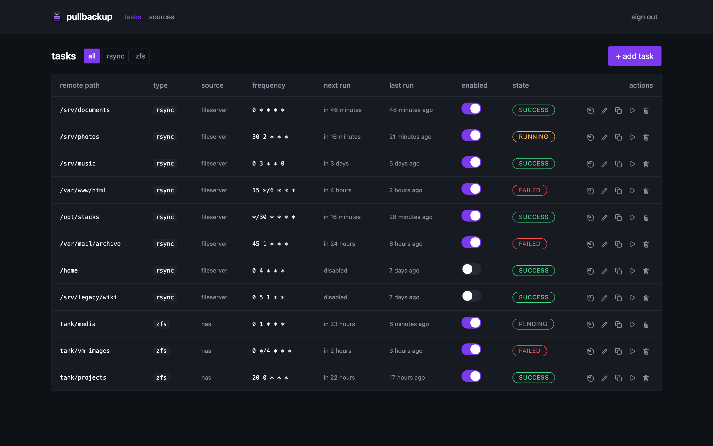
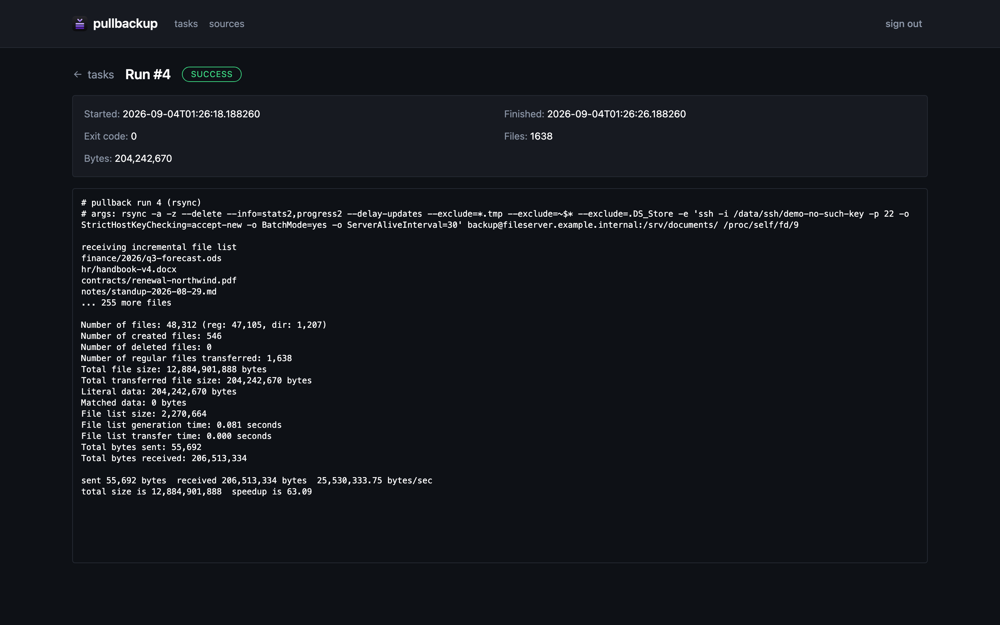
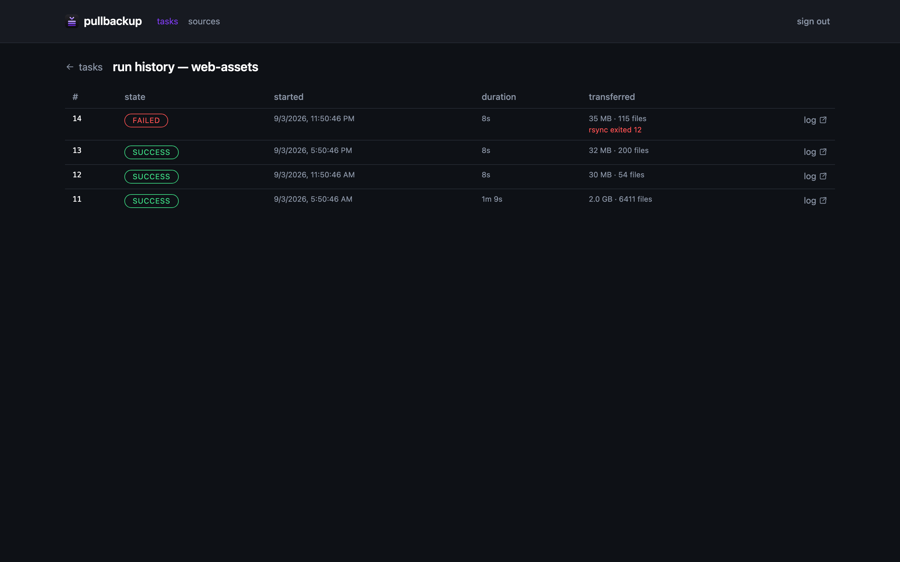
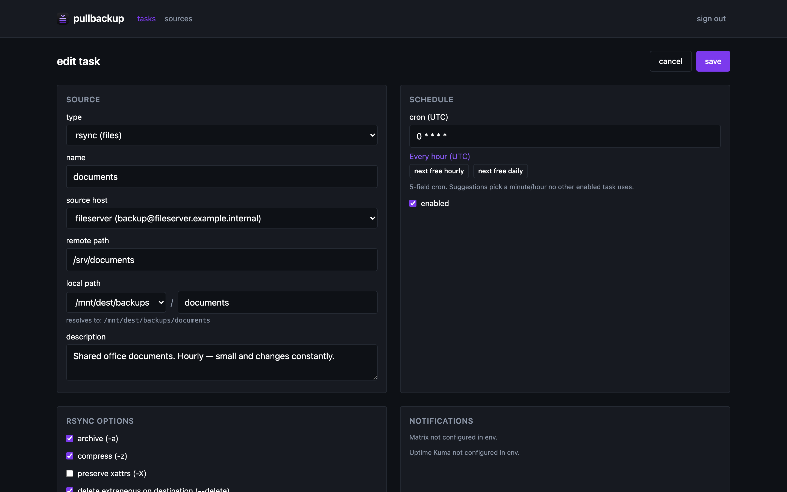
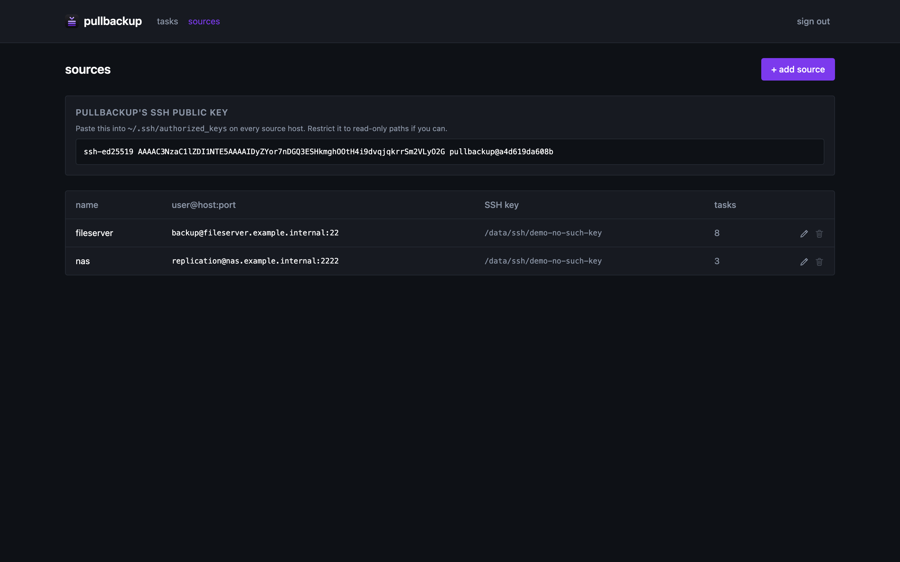
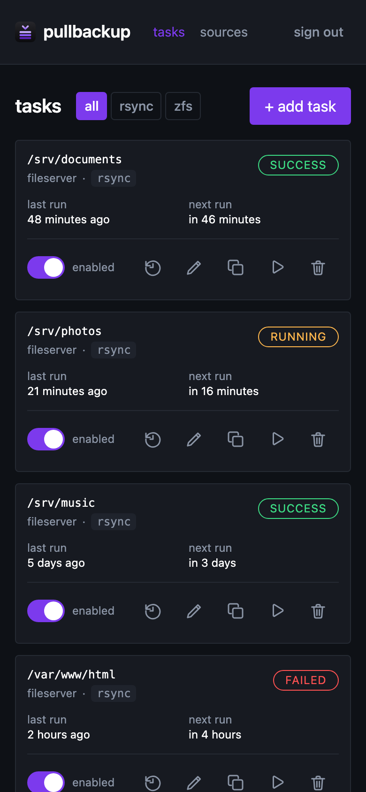

# Pullbackup

> **This repository is a read-only mirror.** Development happens on a private
> Gitea instance; commits are pushed here automatically. Pull requests opened on
> GitHub cannot be merged and may go unnoticed — please
> [open an issue](../../issues) instead, which is read. See
> [CONTRIBUTING.md](CONTRIBUTING.md).

Pull-only rsync task manager. Web UI like TrueNAS's "Rsync Tasks" but inverted: the puller holds all credentials, sources never need anything from us.

**Stack:** FastAPI (Python 3.13) · SQLite · APScheduler · React 18 + Vite + Tailwind + shadcn/ui

## Screenshots

Every host, path, schedule and byte count below is fabricated. They come from a
throwaway local instance produced by [`scripts/seed-demo.py`](scripts/seed-demo.py)
— see [`docs/demo.md`](docs/demo.md) — never from a real deployment.

[](docs/screenshots/tasks-desktop.png)

The task list, filtered by engine. Each row carries its schedule, last and next
run, and the outcome of the most recent run.

[](docs/screenshots/run-log-desktop.png)

A finished run: exit code, byte and file counts, and the complete `rsync` output
including the `--stats2` summary. Logs stream live while a run is in progress.

<table>
<tr>
<td width="50%"><a href="docs/screenshots/run-history-desktop.png"></a></td>
<td width="50%"><a href="docs/screenshots/task-form-desktop.png"></a></td>
</tr>
<tr>
<td>Per-task run history — durations, throughput and failures.</td>
<td>The task form, with the usual rsync knobs.</td>
</tr>
<tr>
<td><a href="docs/screenshots/sources-desktop.png"></a></td>
<td align="center"><a href="docs/screenshots/tasks-mobile.png"></a></td>
</tr>
<tr>
<td>Sources — defined once, reused across tasks.</td>
<td>The same list on a phone.</td>
</tr>
</table>

## Concepts

- **Source** — a remote host you pull from (name, `user@host:port`, SSH key). Defined once, reused across tasks.
- **Task** — a scheduled `rsync` pull from a source path → local path, with the usual rsync knobs (archive, compress, delete, bwlimit, excludes …).
- **Run** — one execution of a task. Records exit code, byte/file counts, link to streaming log.

## Notifications (per task)

- **Matrix** — checkbox; failures (and optionally successes) post to a configured room.
- **Uptime Kuma** — checkbox; Pullbackup creates a Kuma push monitor for the task and updates the heartbeat interval whenever the cron changes. Disabled tasks → paused monitor. Deleted tasks → deleted monitor.

## Deployment

Pullbackup ships as a single container image and is deployed as a Docker
Compose stack. No image is published yet, so build it from a checkout. The
`Dockerfile` at the repository root is a multi-stage build that compiles the
frontend and packages the backend with `rsync`, `ssh` and `syncoid`:

```bash
git clone https://github.com/mikeotoole/pullbackup.git
cd pullbackup
docker build -t pullbackup:local .
```

[`docker/compose.example.yaml`](docker/compose.example.yaml) is a starting
point. It builds the same image from the repository root, so from the `docker/`
directory `docker compose up -d --build` is enough once a `.env` beside it
supplies the values from [`.env.example`](.env.example).

Bind-mount the destination roots you want exposed; Pullbackup's filesystem
browser is allowlisted to those roots. All UI and API routes except
`/api/system/health` require authentication: a signed session cookie obtained
from the login page, or HTTP Basic credentials for scripted access.

```
volumes:
  - ${DOCKER_VOLUMES}/pullback/data:/data        # sqlite, logs, ssh keys
  - /mnt/user/backups:/mnt/dest/backups          # destination root
  - /mnt/user/media:/mnt/dest/media              # add more roots as needed
```

## Local dev

```bash
# Backend
cd backend
uv sync
export PULLBACKUP_HTTP_BASIC_USERNAME=pullbackup-dev
export PULLBACKUP_HTTP_BASIC_PASSWORD=$(openssl rand -base64 32)
uv run uvicorn pullbackup.main:app --reload --port 8000

# Frontend (separate terminal)
cd frontend
npm install
npm run dev   # Vite proxies /api → :8000
```

> **Note on naming.** The product is Pullbackup, and so are the Python package
> and the `PULLBACKUP_` environment prefix. Two identifiers still carry the
> shorter former name and are renamed separately: the host data directory
> (`${DOCKER_VOLUMES}/pullback/data`) and the SQLite file inside it
> (`pullback.db`). Do not rename the host data directory or the database on
> your own — they hold the database, run logs, and SSH keys, and pointing the
> app at a new path or filename starts it against an empty directory.
> `PULLBACKUP_DB_FILENAME` exists so that rename can be done deliberately,
> with a backup, when you choose.

## Env

See `.env.example`. Deployment requires both `PULLBACKUP_HTTP_BASIC_USERNAME` and `PULLBACKUP_HTTP_BASIC_PASSWORD`; the password must contain at least 32 characters. Keep the password in the deployment secret store, not in source control.

### Signing in

Opening the UI presents a sign-in form at `/login`. Submitting the configured
credential exchanges it for an `HttpOnly`, `SameSite=Lax` session cookie
(`Secure` when the request arrives over https), so the credential is not
re-sent on every request. Sessions last 7 days by default
(`PULLBACKUP_SESSION_MAX_AGE_SECONDS`) and **sign out** in the header
invalidates the session server-side, not just in the browser.

HTTP Basic still works unchanged for scripted callers and for the container
healthcheck — a request authenticates with either a valid session cookie or
valid Basic credentials:

```
curl -u "$PULLBACKUP_HTTP_BASIC_USERNAME:$PULLBACKUP_HTTP_BASIC_PASSWORD" \
  http://localhost:8000/api/tasks
```

An unauthenticated `/api/*` request is always refused with `401`, but the
`WWW-Authenticate: Basic` challenge on that refusal is omitted when the caller
is recognisably a browser — a `Sec-Fetch-Mode` other than `navigate`, an
`X-Pullbackup-Client: web` header (the UI sends it), or `Accept:
text/event-stream`. Otherwise the browser would pop its own native credential
dialog in front of the sign-in page. Scripted callers, the container
healthcheck, and a browser *navigating* directly at `/openapi.json` all still
receive the challenge, so `curl -u` and `--anyauth` are unaffected.

Cookies are signed with `PULLBACKUP_SESSION_SECRET` when it is set. When it is
not, the signing key is derived from the configured credential, so upgrading
needs no new configuration — with the deliberate consequence that **changing
the username or password invalidates every existing session**. Set an explicit
secret if you would rather rotate the password without signing everyone out.
Sessions are held in process memory, so restarting the container also signs
everyone out.

The signing itself is [`itsdangerous`](https://itsdangerous.palletsprojects.com/),
the Pallets library Starlette's own `SessionMiddleware` uses. Expiry and
revocation stay in this codebase: a signed token is valid until it expires by
definition, so "logout kills this cookie" needs server-side state whatever
signs the token.

Repeated failed sign-ins from one address are locked out for 60 seconds after
5 failures. HTTP Basic had no login endpoint to brute-force; a form does.

### Behind a reverse proxy

The throttle keys on the address the app actually sees. Behind a reverse proxy
that is the *proxy's* address for every caller, so by default all clients share
one failure bucket — five wrong guesses by anybody locks the login form for
everybody for 60 seconds. HTTP Basic is unaffected, so a scripted caller always
has a way in, but the form is unusable for the duration.

Set `PULLBACKUP_TRUSTED_PROXIES` to a comma-separated list of the proxy
addresses or CIDR ranges you control:

```
PULLBACKUP_TRUSTED_PROXIES=172.18.0.0/16
```

Only then is `X-Forwarded-For` consulted, and only for requests arriving from
one of those addresses; each real client then gets its own bucket. A request
from anywhere else has its forwarding headers ignored entirely, so the header
can never be used to escape the limit. Leaving the setting empty keeps the
pre-existing behaviour exactly.

Only list proxies you actually control — any host in this list can claim to be
forwarding for any client. A value that is not a valid address or CIDR is
refused at startup rather than silently ignored.

This build reads the `PULLBACKUP_` prefix. If it finds a retired `PULLBACK_`
name with no `PULLBACKUP_` counterpart it **adopts that value and logs a
warning**, rather than falling back to a built-in default — which would widen
the rsync destination allowlist and blank the HTTP Basic credentials. Both
prefixes may be set at once during a deployment cutover; the new names win.
The adoption shim is temporary: rename your variables and it goes quiet.

`PULLBACKUP_ZFS_DEST_ROOTS` is a comma-separated allowlist for Syncoid destinations and ZFS pruning. Each Syncoid destination must be a descendant of one configured dataset root (for example, `cache/docker_remote/eel` beneath `cache/docker_remote`). An empty allowlist disables Syncoid and pruning operations. `PULLBACKUP_DEST_ROOTS` remains the separate filesystem allowlist for rsync destinations and the browser.

### Concurrency

`PULLBACKUP_MAX_CONCURRENT_RUNS` (default `3`) bounds how many backups execute
at the same time. The bound exists because the disks and the uplink are shared:
unbounded parallel rsync/syncoid would thrash both. Set it to `1` for a
deployment that genuinely wants one transfer at a time; a value below `1` is
refused at startup, because with no slots every run is admitted and then waits
forever without starting.

Raising it never allows two backups into the same place. Destination exclusion
is enforced separately and always: two tasks writing the same directory — or
one writing a subdirectory of the other — serialize, as do two Syncoid
replications into the same ZFS dataset or one of its descendants. A run that
finds its destination busy waits and starts when it frees, rather than being
skipped. Runs from the same source also remain serialized.

### Stuck runs

`PULLBACKUP_RUN_TIMEOUT_SECONDS` (default `86400`, one day) bounds how long a
single run may execute. A backup subprocess can hang indefinitely — a dead
network path, a `zfs receive` refusing a diverged incremental, a `zfs destroy`
on a suspended pool — and without a ceiling it holds its executor slot forever
while its run row stays `running`, which blocks every subsequent run for that
source. On expiry the run's whole process group is terminated (so the ssh or
`zfs send | zfs receive` goes with it) and the run is recorded as **failed**,
with the exceeded bound named in the error.

The ceiling covers the **whole run**, not each subprocess: a Syncoid task that
also prunes snapshots shares one deadline across its transfer and its pruning,
so a run can never spend its full ceiling twice. Set it to `0` to wait forever
if your initial replication genuinely runs longer than any ceiling you would
set; a negative value is refused at startup.

`PULLBACKUP_WATCHDOG_INTERVAL_SECONDS` (default `60`) is how often the runner
reconciles active run rows against the executions it is actually running, and
fails any row it provably is not executing. Startup recovery does the same
thing, but only at startup — so without this a row left behind by a crashed
execution blocks its source until someone restarts the container. Liveness is
decided by run ownership, not by a pid (recycled, and not known until after the
exec) and not by elapsed time (which cannot tell a wedge from a long transfer).
A value below `1` is refused at startup: zero would spin rather than switch the
watchdog off.

Matrix and Uptime Kuma credentials are optional; omit their values to disable those integrations.

## Licence

Copyright (C) 2026 Mike O'Toole.

Pullbackup is licensed under the **GNU Affero General Public License v3.0 or
later** (AGPL-3.0-or-later). The full text is in [LICENSE](LICENSE), reproduced
verbatim from the FSF; the copyright notice lives in [NOTICE](NOTICE) so the
licence file stays unmodified.

Source files carry a one-line SPDX identifier
(`SPDX-License-Identifier: AGPL-3.0-or-later`) rather than a repeated notice
block.

The AGPL was chosen deliberately over a permissive licence. Pullbackup is
server software you self-host, and section 13 means that anyone who modifies it
and offers it to others **over a network** must make their modified source
available to those users. Running an unmodified copy for yourself — the normal
case — carries no such obligation.
